# 2026-08-29: board-2 case, bom update
## Board - 2 Case

I finished the case for board - 2 as mentioned in the previous journal. It looks like this:

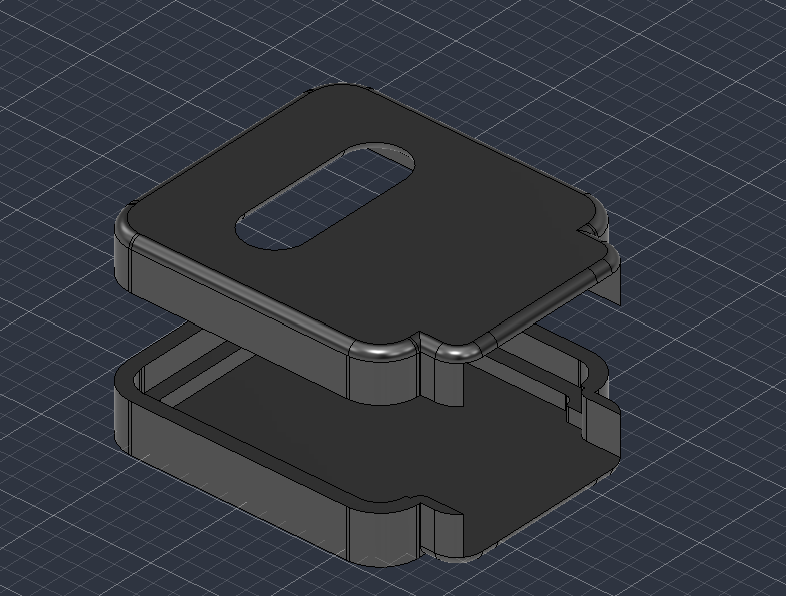

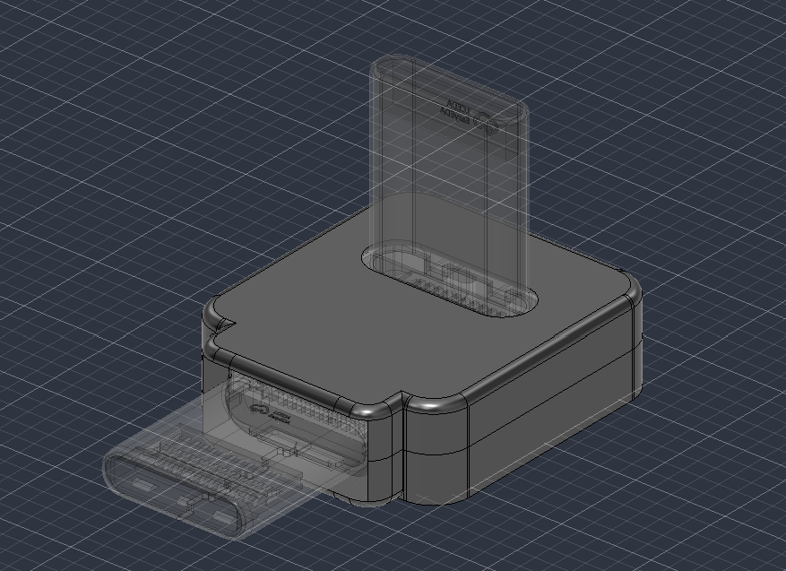

The top and bottom are separate parts that need to be printed separately and after testing the Board-2 PCB and seating it inside the bottom part, the top part will be directly glued onto the bottom part.

I did not add extrusions for friction fitting or anything since this is a really small case (~1.5cm diagonally) and thin extrusions would just break. Also board-2 is really just two USB-C male plugs connected to each other directly, so this should be fine.

## BOM Update

In the previous BOM I did not mention the costs for the acrylic laser cutout for the Main case's lid so here it is in the updated BOM:

| S.No | Name                                 | Description                                        | Qty | Product URL                                                                     | Effective Cost ($) |
| ---: | ------------------------------------ | -------------------------------------------------- | --: | ------------------------------------------------------------------------------- | -----------------: |
|    1 | JLCPCB_PCB                           | PCB                                                |   1 | ~                                                                               |               7.00 |
|    2 | JLCPCB_Assembly                      | PCB Assembly                                       |   1 | ~                                                                               |              68.88 |
|    3 | JLCPCB_Shipping                      | Lowest price shipping: UPS Worldwide Express Saver |   1 | ~                                                                               |               9.10 |
|    4 | JLCPCB_Coupons                       | ~                                                  |   1 | ~                                                                               |             -10.00 |
|    5 | SeeedStudio XIAO RP2350              | MCU: XIAO RP2350                                   |   1 | [robu.in/...](https://robu.in/product/seeedstudio-xiao-rp2350-raspberry-pi-rp2350/) |               8.69 |
|    6 | Shipping for SeeedStudio XIAO RP2350 | Standard Shipping for XIAO RP2350                           |   1 | ~ |               0.51 |
|    5 | Acrylic Lid for Main Case            | Acrylic Laser Cutout (Qty = 2 as cost per piece is below 80INR and robu.in requires minimum cost to be atleast 80INR for non-metal laser cutting service order)                                  |   2 | ~ |               1.63 |
|    6 | Shipping for Acrylic Lid | Standard Shipping for Acrylic Lid                           |   1 | ~ |               0.51 |
|      |                                      |                                                    |     | **Total ($)**                                                                   |          **86.32** |

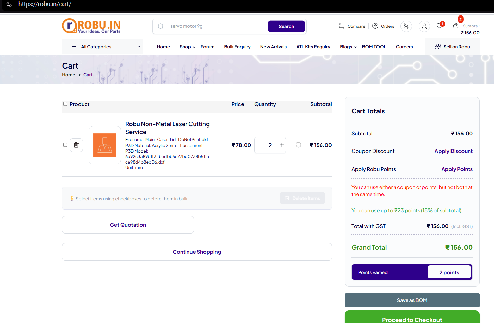

Robu.in does not allow laser cutout service orders in the same cart as normal products, hence the two different 0.51$ shipping costs (standard cheapest shipping is 49INR).

The PCBA BOM and CPL/Gerber files are available in the GitHub repository, under `hardware/Ordering` directory.

## Complete!

This was the last journal before review as also mentioned in the previous journal.

The firmware part is done in a basic way, all the cases have been designed and the PCB is complete.

Now all that left is to order the PCB, components and make the firmware work properly after extensive testing.

## **Thank you for reading my journal, Good luck!**
 

**Total time spent: 2 hours**

# 2026-08-29: Firmware current state, bom stuff
I finished basic firmware stuff for the project and the following is what is done and what isn't.

## Current Firmware State

Firmware is WIP and needs real-world testing, hence the current state is very basic.

Currently only these two things have been tested to work:

- Windows11 recognizes it as a USB Audio Class 2 Device
- Streaming audio makes the onboard LED as set in the Blink pattern enum in [PicoDAC.c](./PicoDAC.c)

The following stuff is **implemented but untested** and will be tested, fixed if required **once I get my hands on the necessary components or/and the built PCB**:
- Onboard Neopixel RGB LED working
- DAC Initialization process

The following stuff will be implemented after the stuff mentioned above is done:
- DAC audio playback (ring buffer implementation?): Requires the initialization step to work correctly. Without ensuring that the DAC initializes and the register read/writes happen properly, implementing this would be a dumb idea and possibly a waste of time.
- 9x RGB LED strip (music level visualizer): Since it requires me to process the music data, I've decided to do it after the DAC accepts the USB audio data first.

## Current Startup sequence
1. Power On (everything is powered up, uses USB-C VBUS)
2. MCU's Onboard LED indicator blinks and shows USB status live accodingly
3. MCU's Onboard Neopixel indicator shows DAC init status **(untested)**
    - Blue = init
    - Green = DAC OK
    - Red = DAC init failed / error

## JLC Ordering
I optimized the BOM to use basic parts wherever possible (changed some capacitor and resistor part numbers in the BOM while ensuring the specs remain the same). 

I added in the GitHub repository, a Ordering subdirectory inside the Hardware directory which contains the bom, cpl and gerber zip files so anyone can order the PCB/PCBA.

I also finalized the BOM (it is in the github readme at the bottom) with total cost of the PCB, PCB Assembly and extra components.

Cart Screenshots:

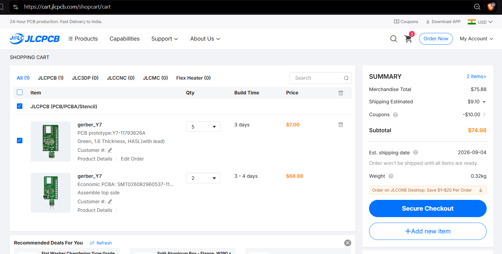

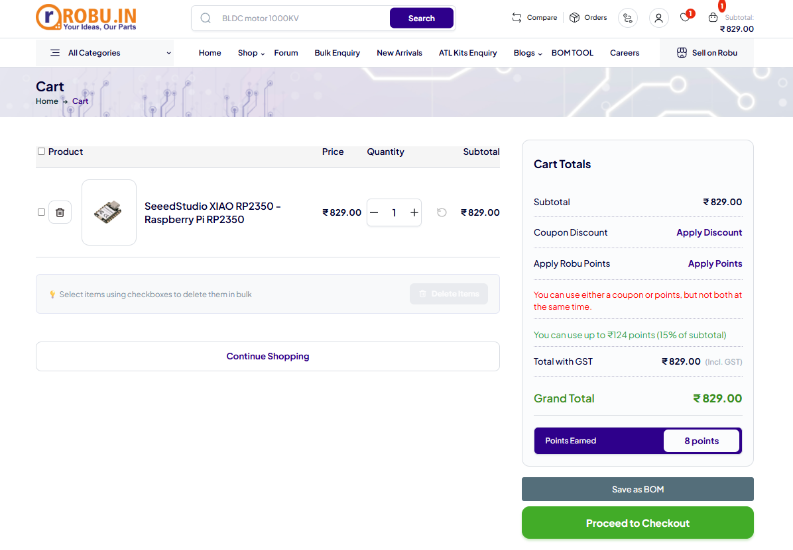

BOM Table:

| S.No | Name                                 | Description                                        | Qty | Product URL                                                                     | Effective Cost ($) |
| ---: | ------------------------------------ | -------------------------------------------------- | --: | ------------------------------------------------------------------------------- | -----------------: |
|    1 | JLCPCB_PCB                           | PCB                                                |   1 | ~                                                                               |               7.00 |
|    2 | JLCPCB_Assembly                      | PCB Assembly                                       |   1 | ~                                                                               |              68.88 |
|    3 | JLCPCB_Shipping                      | Lowest price shipping: UPS Worldwide Express Saver |   1 | ~                                                                               |               9.10 |
|    4 | JLCPCB_Coupons                       | ~                                                  |   1 | ~                                                                               |             -10.00 |
|    5 | SeeedStudio XIAO RP2350              | MCU: XIAO RP2350                                   |   1 | [robu.in/...](https://robu.in/product/seeedstudio-xiao-rp2350-raspberry-pi-rp2350/) |               8.69 |
|    6 | Shipping for SeeedStudio XIAO RP2350 | Shipping for XIAO RP2350                           |   1 | ~ |               0.51 |
|      |                                      |                                                    |     | **Total ($)**                                                                   |          **84.18** |

## Next Steps

Next I will be designing the case for Board-2 (USB-C M-M adapter board) which is the finish line to submit this project for review.
 

**Total time spent: 0.5 hours**

# 2026-08-29: i am losing my mind
## Firmware progress 🥹🥹

So in the last journal I mentioned I got Windows to recognize my Pico as an audio class device using the tinyusb's uac2_speaker example.

However, I found out that while it did get recognized as an audio class device, actually playing any audio after connecting the device to my PC made:
- windows explorer crash for a bit (it did restart and worked fine after a bit automatically)
- volume slider in windows would randomly change it's values (would go up/down randomly) while the device was connected
- pico board crash as soon as audio playback started
    - I tested and confirmed this using the Pico's onboard LED. I patched the LED code such that it blinked simultaneously within intervals of 100ms and as soon as audio playback started, the LED would freeze in the exact last state that it was in, which indicated that the Pico had crashed or reset (I know this behavior from past experiences with the Pico)

While I did confirm that the Pico was crashing/resetting, I seriously had NO idea whatsoever about what was causing it so I tried
- changing my USB cable
- using a different Pico board (XIAORP2040 as it has USB-C instead of micro usb that I got from the hackpad)
- disabling/enabling audio debug tasks
- reviewing the LED code again and again to confirm whether it was actually resetting or the LED code had some bug (it did not xd)

This took my around 3 hours of serious brainpower use and then I found out that some people also experienced the same issue with this exact PicoSDK + TinyUSB version. [Here is this GitHub issue](https://github.com/hathach/tinyusb/discussions/3215).

So, as mentioned in the issue, I tried downgrading TinyUSB from version `0.18.0` to `0.17.0` while keeping the PicoSDK version same and guess what.. It worked.

This marks the end of my journey to get USB audio working on the MCU and the next steps would be cleaning up the current messy codebase and then doing my best implementation of the firmware required for the DAC IC.

## ***Thank you for reading my journal, this one made me lose my mind.***

I've added a separate readme file in the firmware directory inside the GitHub repository where I have mentioned this issue and the solution to it so that anyone following along does not waste as much time as I did.

PicoDAC USB Device is no longer glitchy! Here is a bonus image of discord recognizing PicoDAC as a USB audio device!!!! (wohooo)

 

**Total time spent: 0 hours**

# 2026-08-22: firmware
## PicoDAC Firmware

I researched about USB audio, how it works and what are the requirements to get it working on a RPI PICO board.

Since I currently possess a PICO 1 devboard, I made the firmware run on that for now just to test the USB functionality (whether windows recognizes the device as an audio device, sends audio data and stuff)

This was a grueling task but after like 4 locked-in hours I finally got it to work. Current source is almost an identical copy of the [`uac2_speaker_fb` example](https://github.com/hathach/tinyusb/tree/master/examples/device/uac2_speaker_fb/) in the [TinyUSB github repository](https://github.com/hathach/tinyusb), but instead of a common `bsp/board_api.h` we are using `pico/stdlib.h` along with some more modifications, which were required for the example to work properly.

Windows recognizes the Pico as an audio device with the name PicoDAC Device:

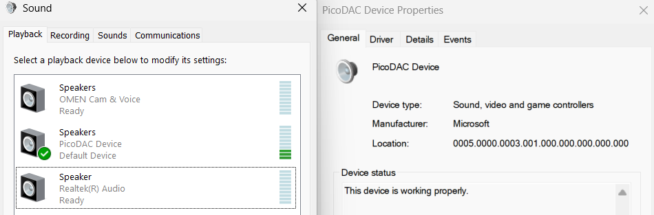 

The firmware source is available in the GitHub repository.
 

**Total time spent: 0 hours**

# 2026-08-21: PCB Rev 1.5 + Main Case
### **Buckle up, deadline is near!!!!**

In this journal I describe how I made the case for the main board, what problems I encountered while doing so and how I fixed them. In-case I've missed any preview image or you need a reference, feel free to checkout the GitHub repository as it has all the necessary files related to the CAD or PCB.

*Fusion360 crashed 11 times during my quest to make the Main Board Case 💖*

## PCB Rev 1.5

When I made the first basic iteration of the enclosure, I found out that the 3.5mm audio jack on my PCB was placed incorrectly (as in not at the edge).

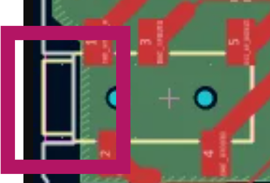

As we can see, the Edge.Cuts pcb edge actually needs to be connected in a straight line directly to the Edge.Cuts line defined in the audio jack footprint.

What I mean by that is this:

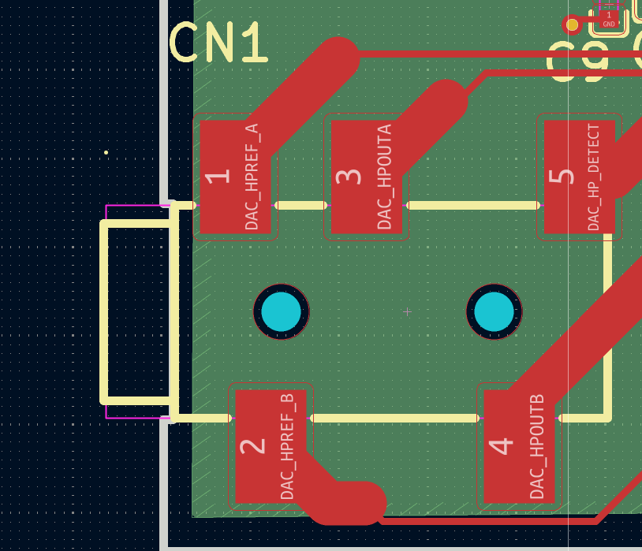

This is the only change in the PCB, which required me to move the MCU a bit to the right along with rerouting all the traces connected to the MCU.

What this does is give us enough room for the enclosure to expose the audio jack hole after factoring in tolerance offsets of the 3d print and the male connector's housing (which could've potentially caused badly connected jack if I had not fixed this).

This was all for revision 1.5.

## Main Case

This took up a big chunk of my time.

After redoing the entire thing countless times while Fusion360 kept crashing or freezing, I finally completed the enclosure for the Main Board. This required me to watch a lot of YouTube tutorials and read about 3D Printing limitations, some of which I have linked in the references section of this journal.

### Preview Images:

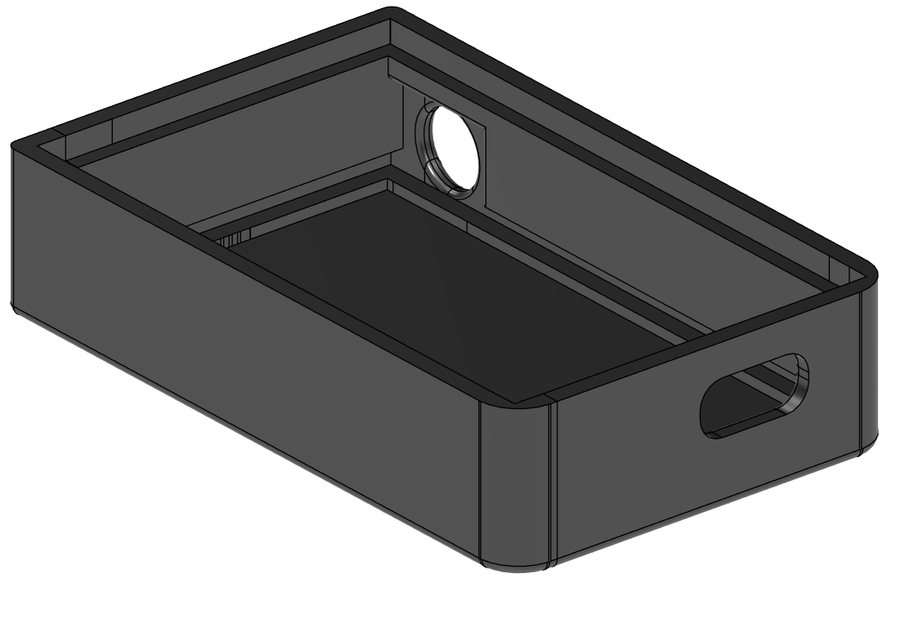

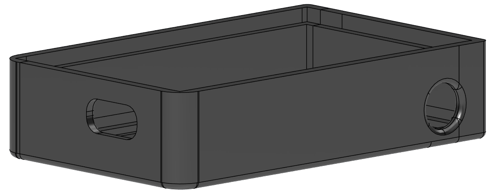

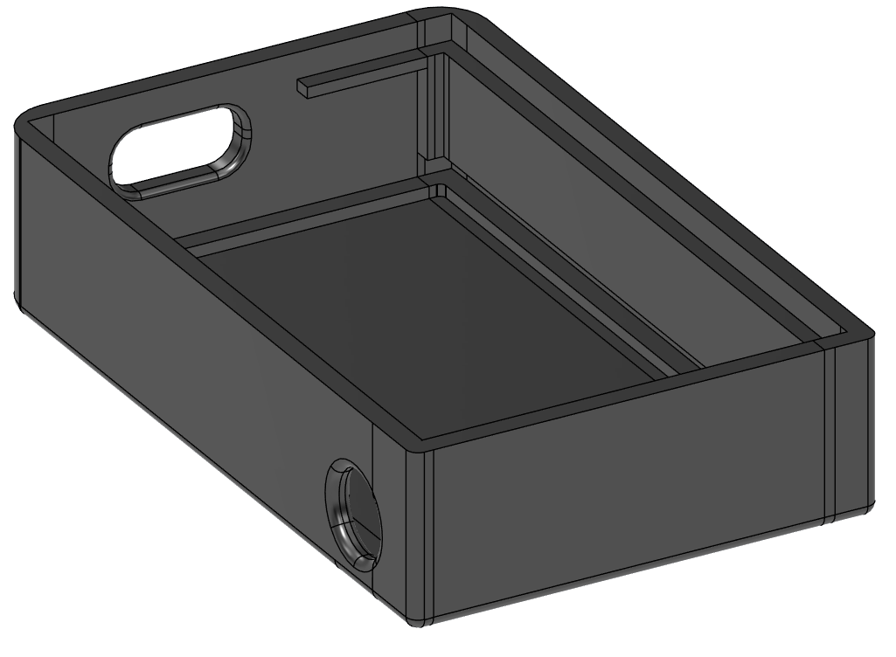

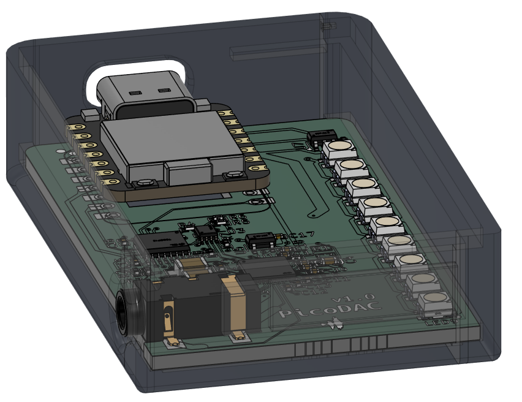

I made the enclosure a cuboidal shape with one side that is detached, to slide in the PCB.

The detached side is friction-fit using cuboidal and cylindrical extrusions on both ends.

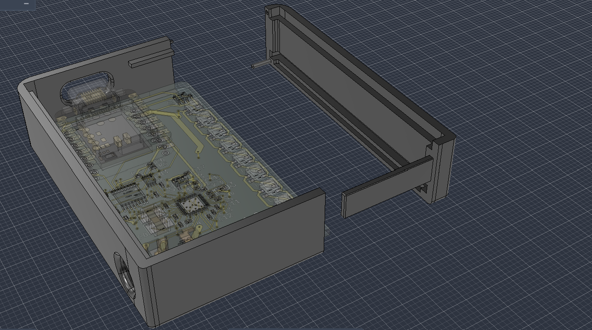

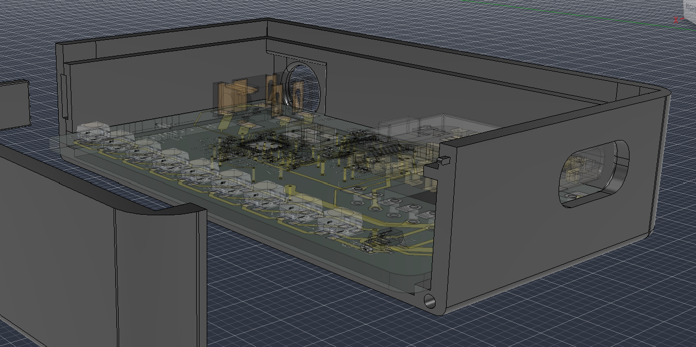

The top face of the cuboidal case is empty with a 2.2mm depression and lips, to hold in place a custom cut transparent acrylic sheet of thickness 2mm. (0.2mm is tolerance value). The dimensions for this acrylic cutout would be:

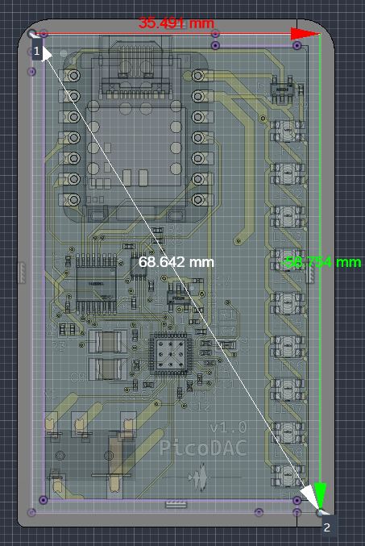
The acrylic sheet will be fixed using superglue / something appropriate to the bigger part of the cuboidal case, but not to the detachable side.

I did it like this so that the PCB is visible from the top of the case (which would look really cool) and also the LED strip would also look really cool when viewed like that. (I'm a fan of see-through electronics!!)

As for Board-2, due to it's small size and relatively simpler shape / dimensions I've decided to make the enclosure for it later. There is also the issue of incorrectly offset clamp/side mount USB-C connector in the exported model from KiCAD so that is also one of the reasons for this delay.

For the time being, I've decided to finish the firmware part and after completing that, I will be finally making the enclosure for Board-2.

## Thank you for reading my journal
*I Hate Fusion360.*

## References
- https://www.youtube.com/watch?v=E0NVC8xhf3I
- https://www.youtube.com/watch?v=TfK47vLOg90
- https://www.youtube.com/watch?v=BmFbxpeXbW0
- https://www.youtube.com/watch?v=GnqhoQHuEq8
- https://www.raise3d.com/blog/3d-printing-wall-thickness/
- https://jlc3dp.com/help/article/3d-printing-design-guideline
- https://wikifactory.com/+wikifactory/stories/ultimate-guide-how-to-design-for-3d-printing
 

**Total time spent: 4 hours**

# 2026-08-19: PCB Rev 1.4
## PCB Revision 1.4

This journal describes all the changes that I mentioned I needed to do in the last journal.

## Capacitors

Originally I used small 0201 package capacitors which required `Standard` assembly at JLCPCB, which ramped up costs of the PCB. So I switched to 0402 package capacitors ((C170151)[https://www.lcsc.com/datasheet/C170151.pdf]).

This meant redoing the PCB portions wherever the 0201 capacitors were used, which I did.

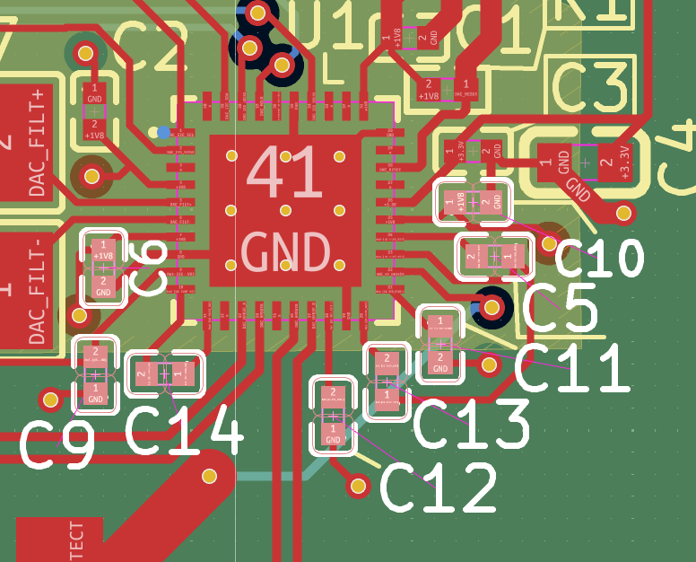

## USB-C connector

The side mount clamp USB-C connector was marked as `Standard` assembly only, So I found an alternative replacement for it which had both options for `Economy` and `Standard` assembly and redid the PCB portion of that too.

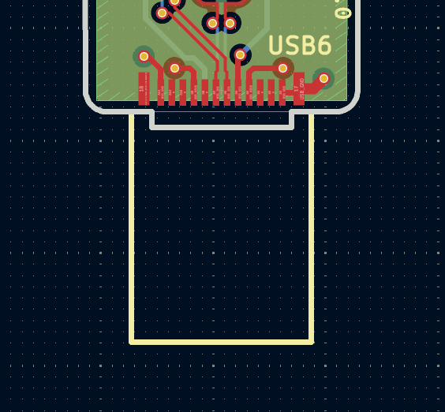

## SK6812 LEDs

The previously selected SK6812 LEDs were also marked as `Standard` assembly only, So again I found alternative replacement for it and redid the PCB portion of it. I could not find one that was the same size as the previously selected ones (5.4x5mm) so I settled with using the currently available (3.5x2.8mm) size SK6812 LEDs.

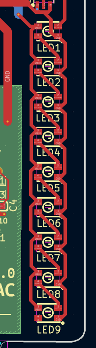

## Heat relief vias

Originally, I had done the GND vias below the CS43131 IC by hand, eyeballing the positions and had forgotten about it.

I fixed it by using the position tools in KiCAD (Shift + P) using proper relative positions, with 1.25mm gaps between each vias in the 3x3 via grid.

I also made the via size smaller to 0.4mm and drill 0.2mm after reading about [Solder drainage](https://www.eurocircuits.com/technical-guidelines/pcb-assembly-guidelines/solder-escape-wick/).

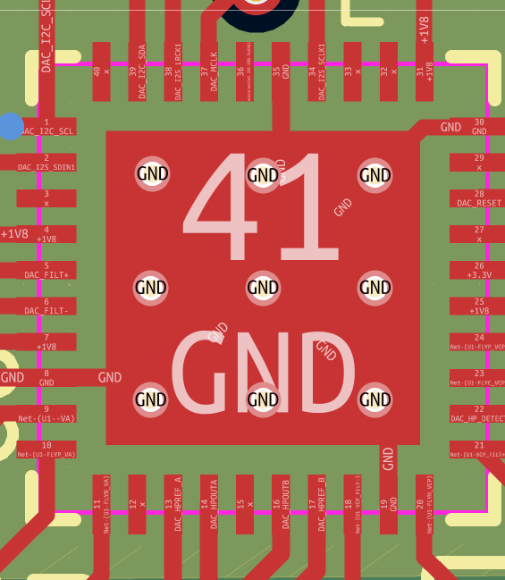

## Final Board looks

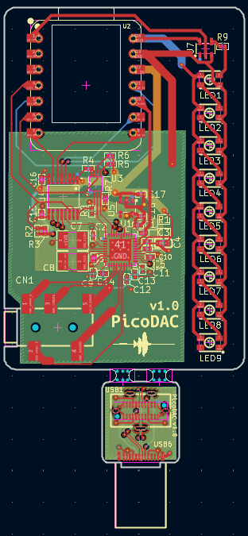

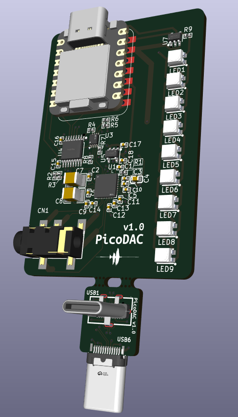

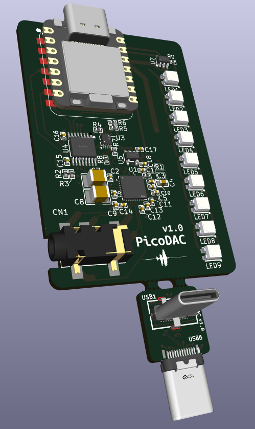

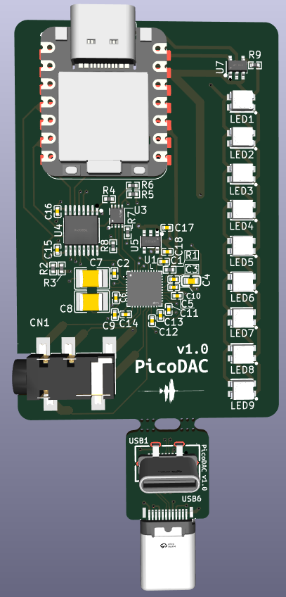

## Final Cost

Even after doing all that, the final cost for assembly came out to be `88.55$`. However, I'm sure I can bring it down a bit using coupons and slower shipping etc.

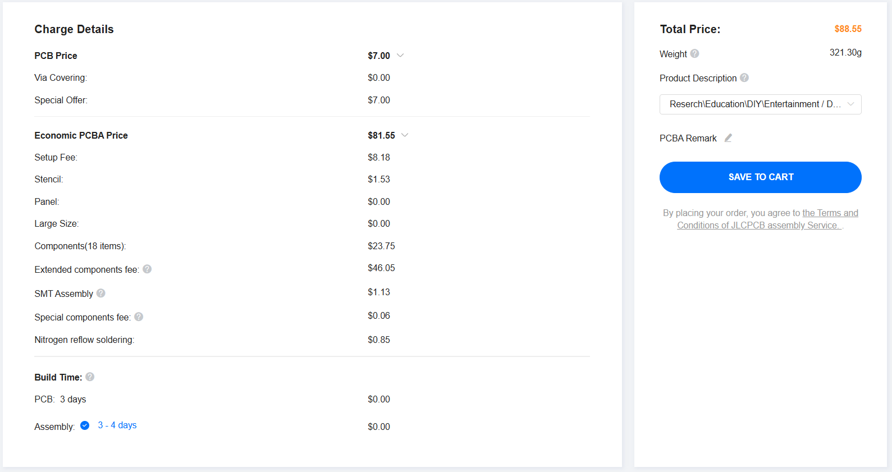

## Next steps

Now, I will be moving on to the CAD case for this.

## ***Thank you***
 

**Total time spent: 2 hours**

# 2026-08-18: LED Positions update + Mousebites + PCB Rev 1.2
## PCB Rev 1.2

I fixed all fixable DRC errors and rounded the PCB corners so that they do not cut my fingers during assembly.

## LED Positions

I moved LEDs a bit down and repositioned the resistor and the logic level translator such that the LED bar would start from (almost) the bottom of the board with a little bit of padding at the bottom. This was done to make the board look aesthetically better.

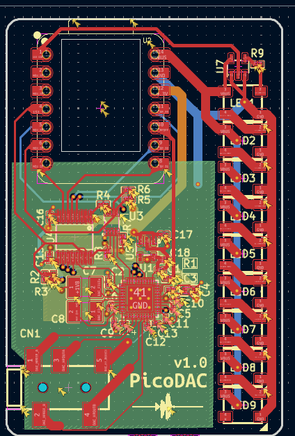

## Mousebites

I connected the Main Board with Board - 2 using 2 mousebite tabs.

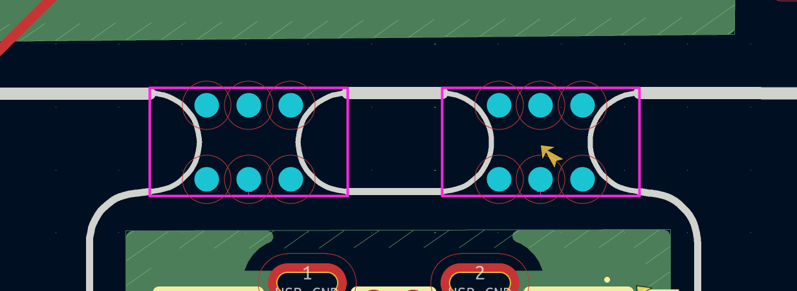

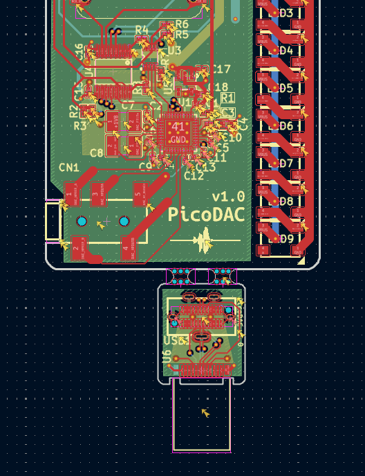

## 3D View

After fixing all the DRC errors, the 3d view finally showed how the board would actually look:

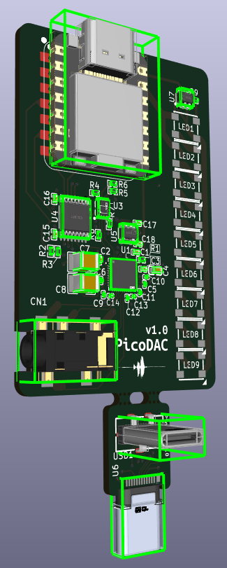

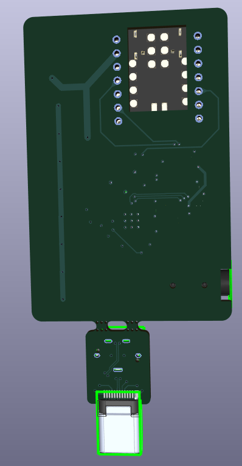

## JLC PCB and Assembly costs

I finished exporting the gerber zip file using [Fabrication toolkit](https://github.com/bennymeg/Fabrication-Toolkit). I tried to use it for BOM and CPL files too but JLC did not accept those (they were missing information for some reason) so I used the built-in KiCad BOM and CPL file exporter tool under the Fabtrication outputs menu and manually edited them such that they worked with JLCPCB.

Finally, after uploading everything and selecting appropriate options, The grand total for 5 PCBS (2 assembled) came out to be `$95.49`, excluding shipping:

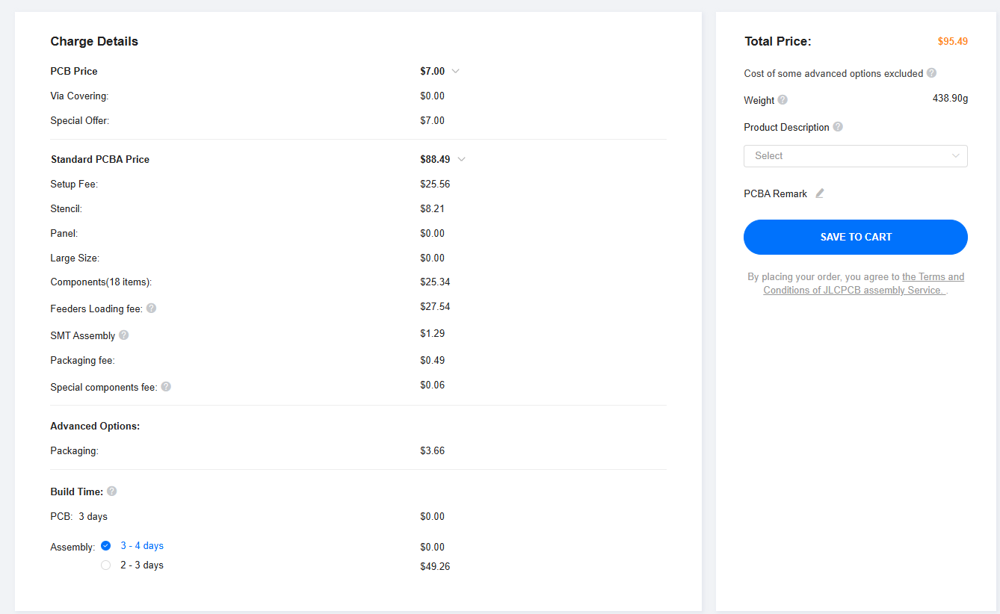

However, this was because some components that I selected required `Standard` PCBA instead of `Economy`, which added 25$ additional fees along with other prices. 

Hence, I will be trying to make the PCB `Economic` assembly next, so that the costs can be lowered.

This includes:
- C5,C6,C9,C10,C11,C12,C13,C14 (2.2uF) capacitors, 0201 package
- SK6812 LEDs (LCSC ID: C5378720)
- Clamping type USB-C plug (LCSC ID: C3151751)

I will try to find alternative parts that can be used with economic assembly, finish the PCB and then hopefully move on to the CAD case part of the project after fixing any other problems if encountered.

## Thank you for reading my journal!
 

**Total time spent: 2 hours**

# 2026-08-16: LED Placement update + PCB Art + Misc
## LED Placement update

I moved the LED row to the Main Board instead of Board - 2 as it was getting too big for just a USB-C male to male extender connection board and also required an external wire to be soldered to solder pads on Main Board and Board - 2.

This comes with 2 benefits:

1. **Tinyyy Board - 2, No solder pads:**

    Board 2 size is now 12.313 x 14.112 mm (excluding the USB-C male protruding connector) which is incredibly small! Also since the LEDs are on the main board, unlike the previous version, no solder pads are required now.

    
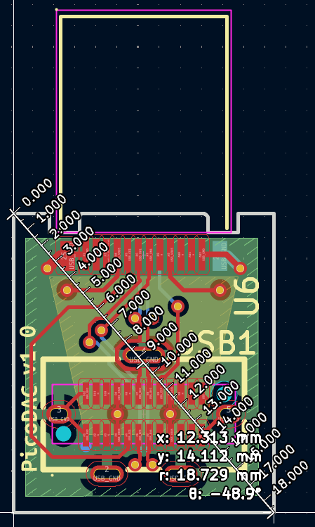

2. **9 LEDs instead of only 4:**

    Since adding 4 LEDs to the main board leaves a lot of empty space, I jumped up to 9 since they fit perfectly, leaving minor spaces at the top and bottom.

    I made sure to use thick enough traces for the power and ground rails, connecting the power rail directly to the MCU's VBUS pin (which would be +5V).

    The Main board now looks like this:
    
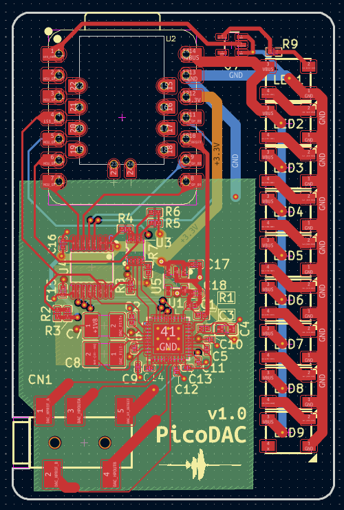

    I'm thinking of using a light diffusing sheet to maybe diffuse the LED lights into a color bar, but I have not yet decided on how exactly I'm going to be doing this. So this is a thought for later, when I make the case for the main board.

## Updated schematics

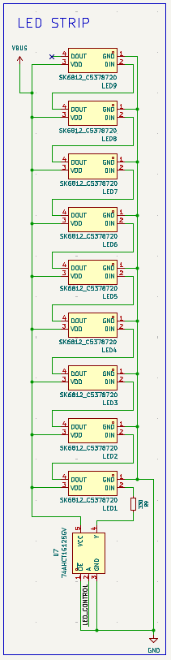

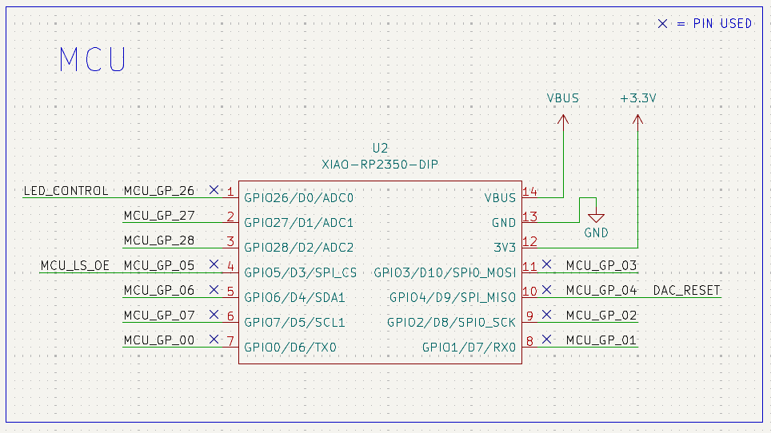

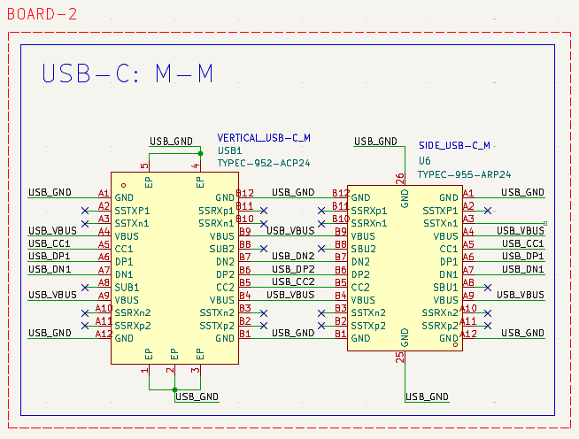

## PCB Art

I was wondering on how to "brand" my PCB such that it accurately depicts what this project is.

As you might have noticed in the previous Main Board picture, I decided to go with an audio waveform graph, generated from my own voice, where I recorded myself saying the name of this project, "PicoDAC". It looks amazing on the PCB and I hope it looks the same when I physically get the PCB.

The logo I made from the waveform (this is supposed to be a small pic):

The actual audio waveform looks like this:

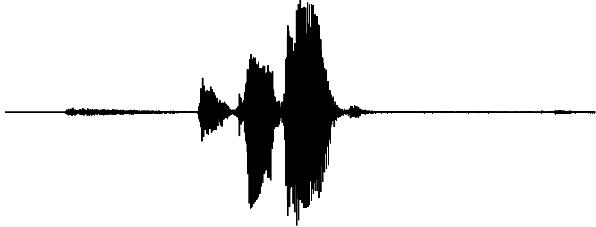

And, on the main board, it looks like this:

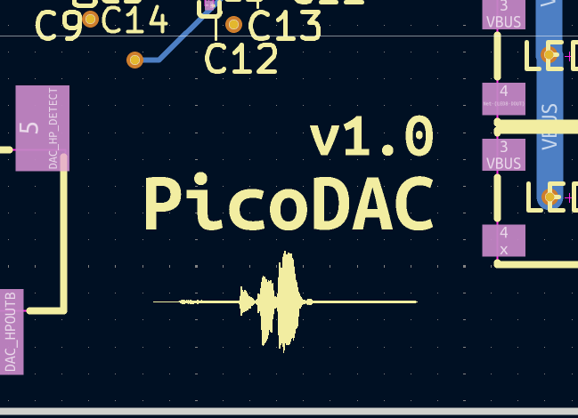

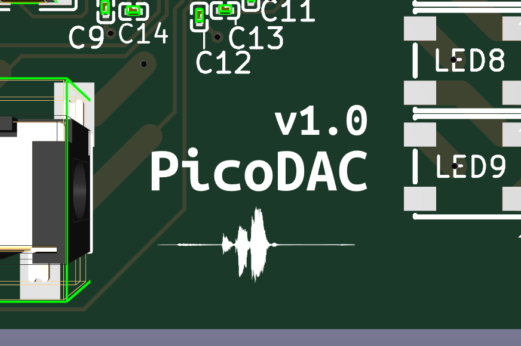

## Misc

Other than that, I changed the shape and dimensions of the ground plane on the main board and replaced the thick power traces on board - 2 with a dedicated power plane.

## **Rough sketch of the Main-Board and it's case:**

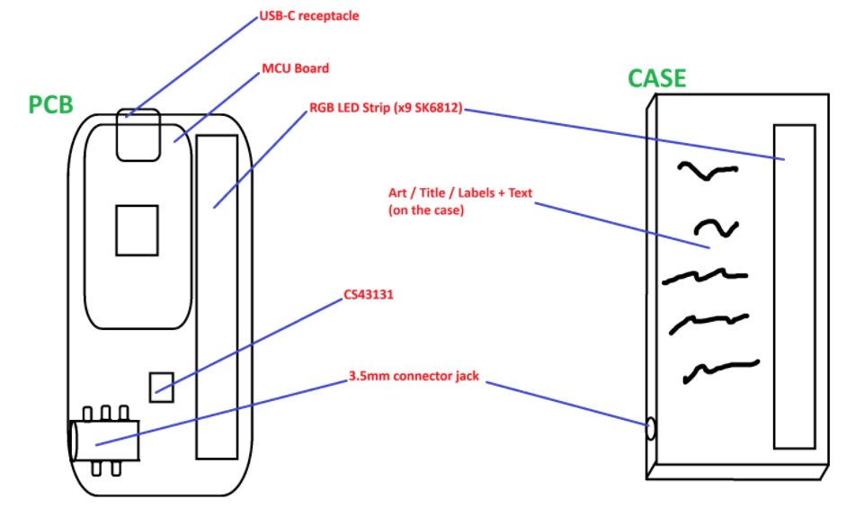

## Next steps

Next I will be 
- fixing DRC errors (there are a lot, related to tolerances etc.)
- adding mousebites in between Board - 2 and the Main Board to easily break it off after I get the PCB.
 

**Total time spent: 3 hours**

# 2026-08-14: Main Board
## Main Board PCB

I finally finished the revision 1 of the main PCB after again checking all the datasheets, verifying connections, placing the capacitors as close to the pins as physically possible etc.

The board, just like Board - 2, is a 4 layer PCB (signal, ground, power, signal).

This took quite a lot of time again, as the DAC schematics were a mess. The level shifters were easier but placing all these components also took a few tries to get correct.

This is of course only the first revision, and I will be changing stuff like orientations, component placements etc. over the next revisions.

I also have not added proper silkscreen art yet (Only name and version are on the board currently) that I will be doing later along with the Board-2 silkscreen art.

**This is how the schematics look, excluding the ground and power layer.**

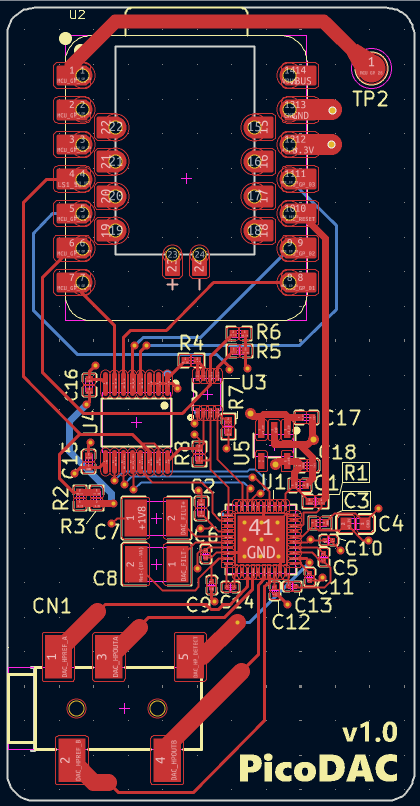

**With the power layer:**

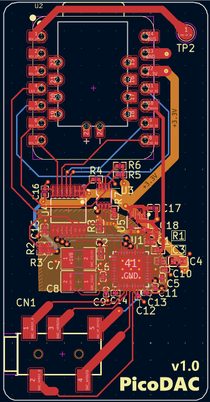

**Finally, with the ground layer:**

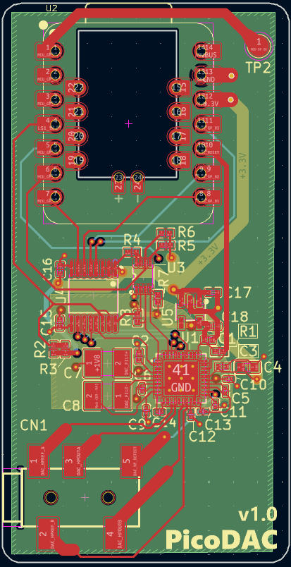

I made the edges of the board a bit rounded to make it look good and hopefully not accidentally cut myself as the edges of PCBs can be quite sharp (speaking from prior experience ;))

The power plane is split into two different components:
- Thick 3.3V power traces
- 1.8V power plane

I did this to make the 1.8V power as clean as possible as it is used directly by the CS43131.

The 3.3V power traces are also quite thick and should not contribute to any noise or EMI (hopefully) and also should not heat up anywhere.

I added teardrops to the connecting pads of the 3.5mm connector and this is how they currently look:

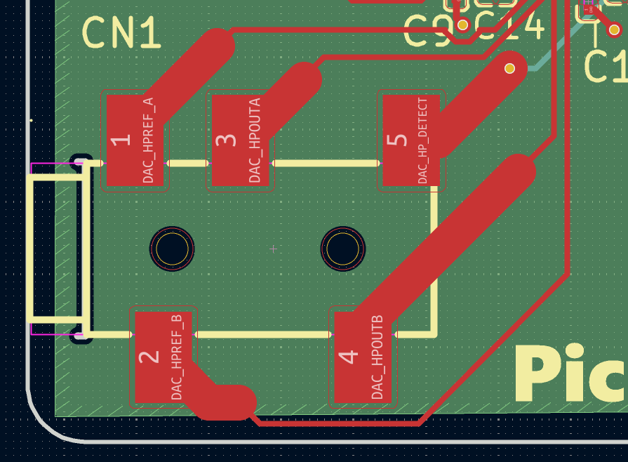

I have currently decided to put the lights solder pad (testpoint) at the right side of the mcu footprint but this might change later on, depending upon how I make the case for this:

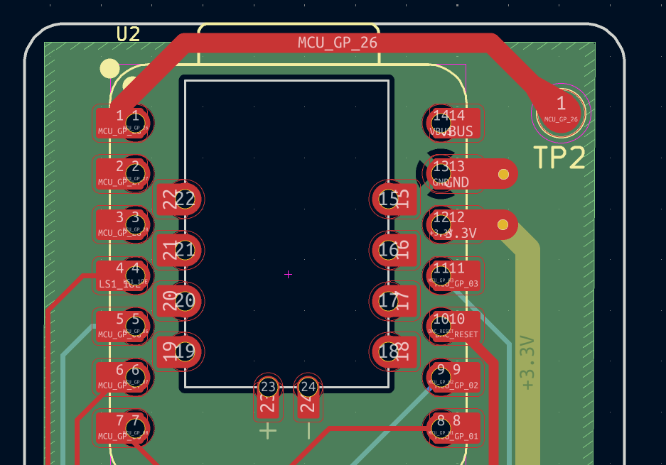

This is the DAC part of the PCB which I finished after a restarting over and over again a lot of times:

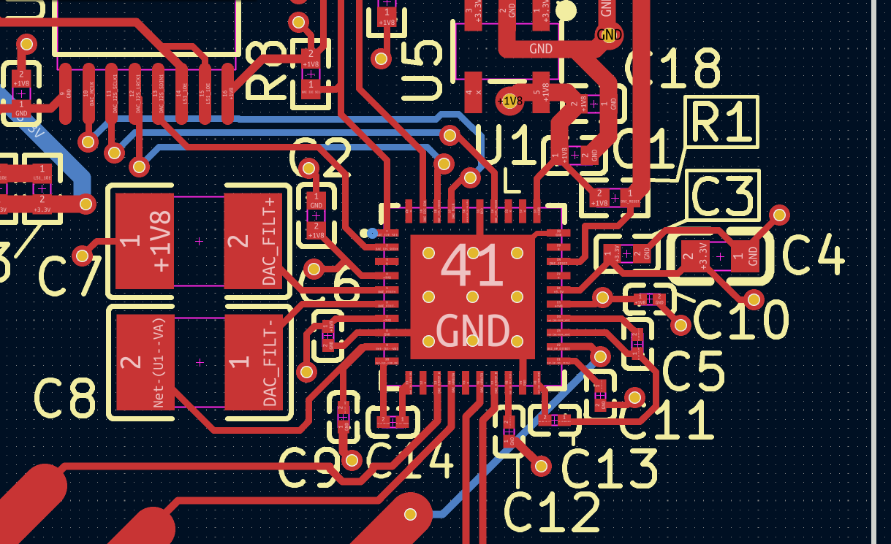

There are some DRC errors that I encountered related to annular width, tolerances, board edges and silkscreen. I ignored all the silkscreen ones (:D) and fixed **some** of the remaining ones, but there are still quite a lot remaining which I will fix in the next journal. Other than that, I will also be fixing any other errors that I can find in both the PCBs and as previously mentioned, updating component placements if required.

Thank you for reading my journal!!! <3

## References
- https://www.lcsc.com/datasheet/C1554754.pdf
- https://www.lcsc.com/datasheet/C668605.pdf
https://www.lcsc.com/product-detail/C2867798.html (english version: https://www.ti.com/lit/ds/symlink/sn74axc4t245.pdf)
- https://www.lcsc.com/datasheet/C51953293.pdf (english version: https://www.alldatasheet.com/datasheet-pdf/pdf/1265214/TI/TPS7A201825PDQNR.html)
- https://www.lcsc.com/datasheet/C33196.pdf
- https://forum.kicad.info/t/how-to-create-teardrops-in-pcb-editor/61920/
- https://electronics.stackexchange.com/questions/686845/pcb-design-question-power-plane-or-fat-traces-for-high-current
- https://www.eevblog.com/forum/eda/should-plane-be-used-to-connect-power-or-just-thicker-tracks/
 

**Total time spent: 4 hours**

# 2026-08-12: Board-2
## Board-2 PCB

I completed routing board-2 PCB after restarting from scratch multiple times while checking datasheets, clearance values and youtube tutorials. The USB-C connectors were especially hard for a first time. At the end, I'm pretty satisfied with how it all turned out, even though it took quite a long time.

Since my main board is also a 4-layer PCB with stackup:
- Signal (Top layer, `F.Cu`)
- Ground Layer (`In1.Cu`)
- Power Layer (`In2.Cu`)
- Signal (Bottom layer, `B.Cu`)

I made board 2 with the same layer stackup as the board-2 will be attached to the main board using mousebites or V-Cuts.

## USB-C

I had to manually edit some footprint properties of the vertical USB-C connector to fix some DRC errors and also changed the Side mount USB-C connector to a different one as the previous one's footprint was weird ish.

I also changed schematics of the USB-C connectors to exclude signal traces like `SSTX` and `SSRX` since our MCU will not be using those pins and they were unnecessarily increasing the PCB complexity.

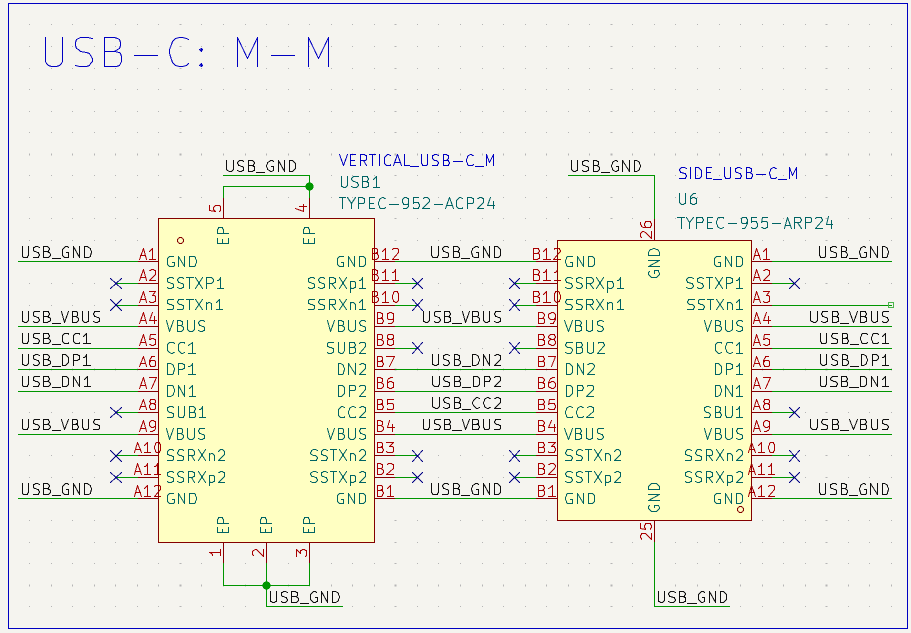

I made sure to route the Dp/D+ and Dn/D- pins as a differential pair to each USB-C connector.

Other than that, I directly connected relevant pins with each other on the USB-C connectors.

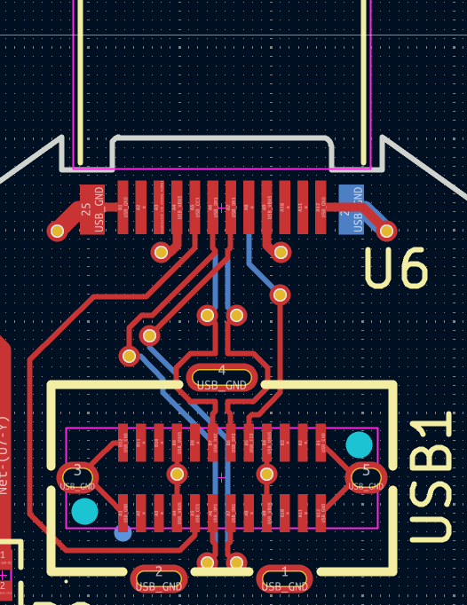

(Ground and power are on separate planes so those pins are just connected to vias)

## LEDs

I routed all the LEDS together as a 4x1 row with thick-enough traces. 

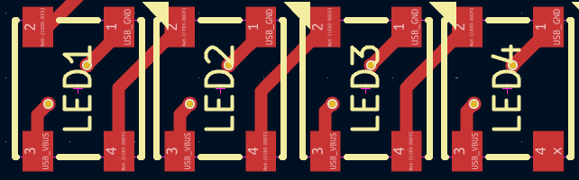

## Level Shifter for LED + Solder pad

I routed the 74AHCT1G125GV level shifter to the LEDs, power and the TestPoint solder pad that will be connected to a similar solder pad on the main board via a wire.

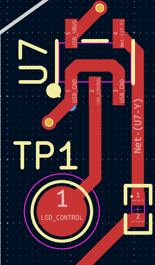

That was pretty much it, the finished board looks like this:

Without ground plane and power layer:

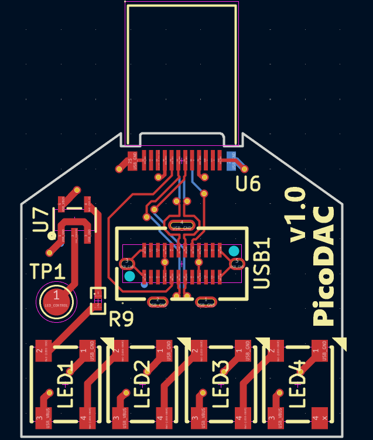

With thick power traces layer:

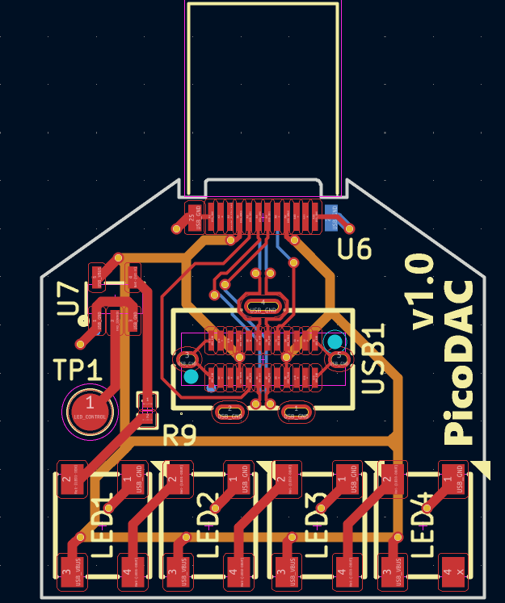

With ground plane:

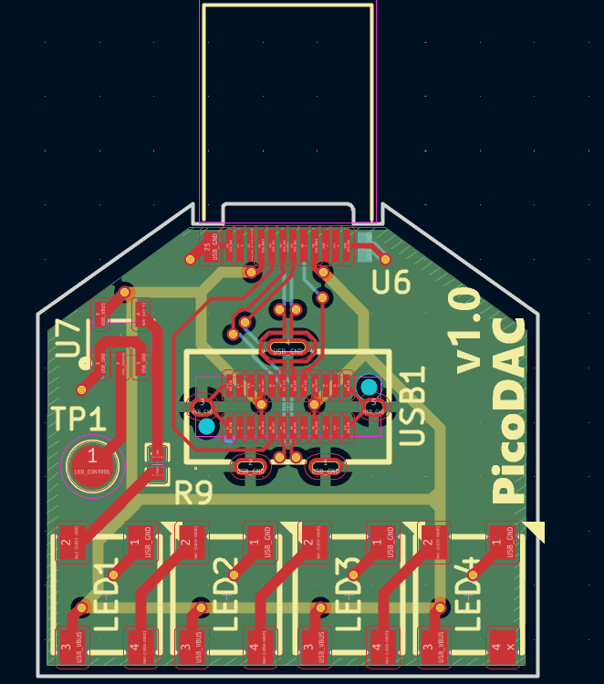

I've yet to style the board, and will be doing that later after finishing the main board PCB.

Thank you for reading this journal!

## References
- https://www.pcbway.com/blog/PCB_Design_Layout/USB_Type_C_PCB_Design_Guidelines_Layout_and_Routing_Best_Practices_55bc0c39.html
- https://support.microchip.com/s/article/USB-Type-C-Layout-Recommendations
- https://ledpixelstrip.com/sk6812-rgb-led-strip-the-ultimate-guide/
- https://www.reddit.com/r/PCB/comments/1jyc46l/pcb_design_for_sk6812_led_strips/
 

**Total time spent: 3 hours**

# 2026-08-05: Final schematics
## Final schematics
This is a long journal so buckle up!

## 1.8V voltage regulator

I chose the XTPS7A2018 voltage regulator to step down 3.3V to 1.8V for supplying to the DAC. 

The reason for going with this specific IC is that it is LDO (Low Dropout Regulator) meaning it can supply stable 1.8V and also as mentioned in the description, "It delivers excellent noise rejection without requiring an additional noise bypass capacitor, while maintaining superior PSRR and line/load transient response.". 

The schematics for it look like:

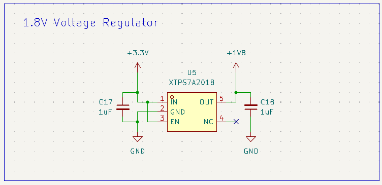

## GPIO Pin connections

I finished the GPIO connections for all the pins including DAC I2S/I2C, DAC Reset, Level Shifter enable and finally LEDs driver pin (more on LED below).

The schematics for that is:

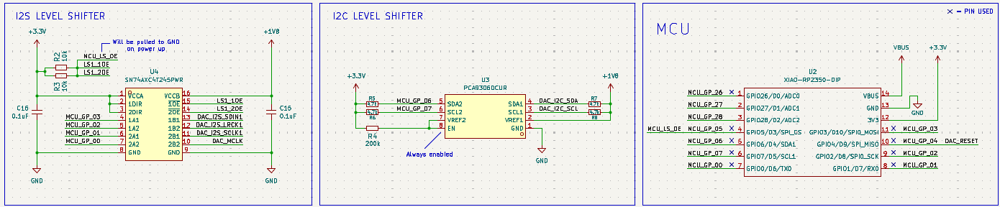 

## Board 2

Since I'm using a XIAO RP2350, which comes with a USB-C receptacle (female plug), it can not directly be plugged into a smartphone's USB-C plug (since that is also a female plug).

To solve this issue, I'm making a separate board that will have two USB-C Male plugs both connected to each other like an extender. This board will be designed in such a way that it fits on to the USB-C receptacle on the XIAO-RP2350 and gives us a free USB-C Male plug that we can plug into our Laptop / Smartphone.

It will be included along with the main PCB, separated using mouse-bites so it can be safely broken away and used.

A rough sketch of what I mean:

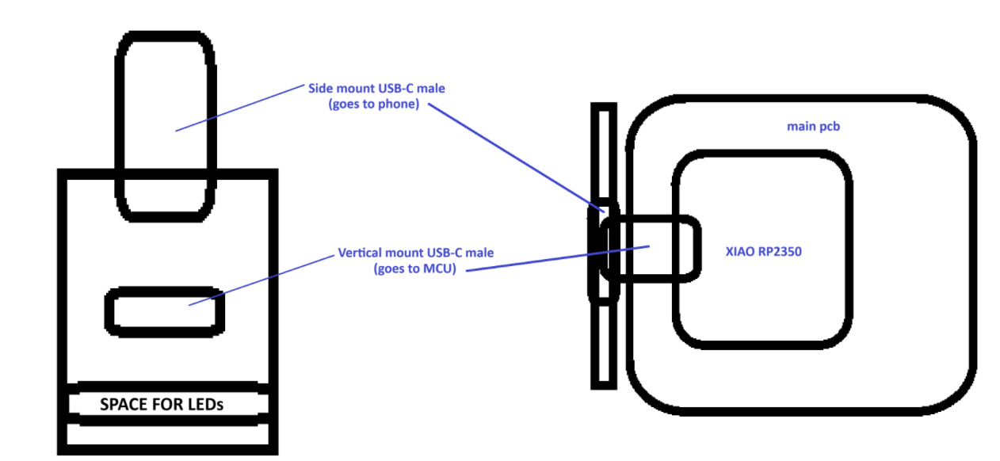

This does mean that the body of this device will extend a bit backwards of the smartphone's USB-C port, However, I will make sure that the USB-C port does not experience too much stress to ensure it does not break easily like what happened to my old DAC.

## Board - 2 : USB-C M-M Schematics

I used a vertical mount USB-C plug and a side mount USB-C plug.

Since vertical mount USB-C plugs are normally more prone to breaking due to plugging/unplugging stress, It will be used for connecting to the MCU (as there is no need to unplug or remove board-2 from the main board).

The side mount USB-C plug will be used to connect to smartphones / laptops etc.

The schematics for this look like:

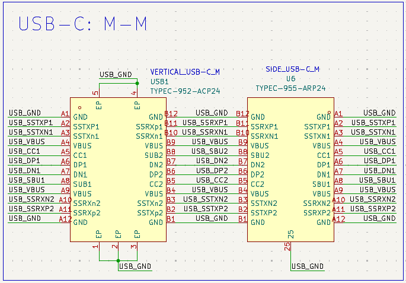

## Board - 2 : LED Schematics

I mentioned the idea of having a music level visualizer in the first journal.

For that, I added 4x SK6812 RGB Leds connected to the USB-Vbus and a GPIO pin on the MCU via a single channel level shifter (74AHCT1G125GV). 

The reason for these specific LEDs is partly that they are RGB and also that a row of these LEDs can be controlled by a single GPIO pin. I was short on GPIO pins so I went with it.

The schematics for this looks like:

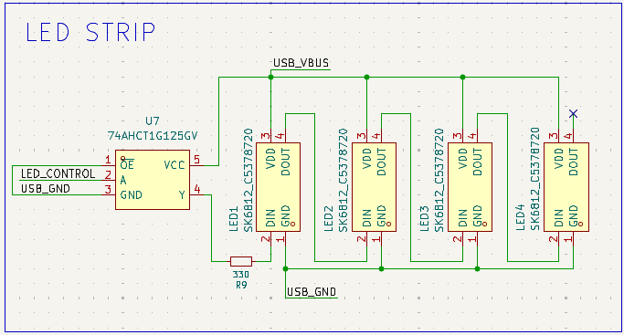

Since these do consume a fair amount of current at max rating, I will be adding some way to disable the LEDs in software.

Also, since the LEDs exist on Board-2, I added 2mm solder pads using test point footprint to connect a single wire from board 2 to main board. This will connect the GPIO pin that is supposed to control the LEDs with the level shifter pin. The schematics for that look like:

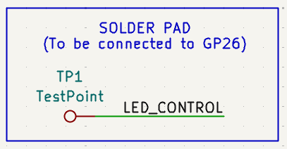

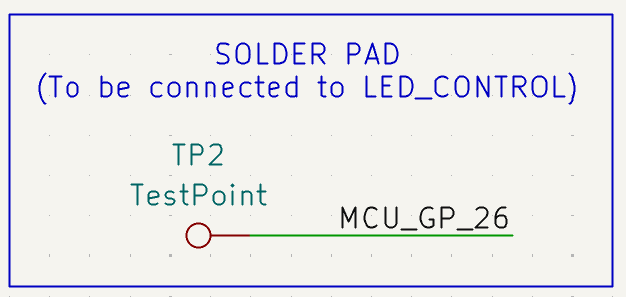
Where TP1 is on Board-2 and TP2 is on main board.

This sums up all the schematics of the PCB. Now I can move on to actually designing the PCB next!

The entire finished schematics are:

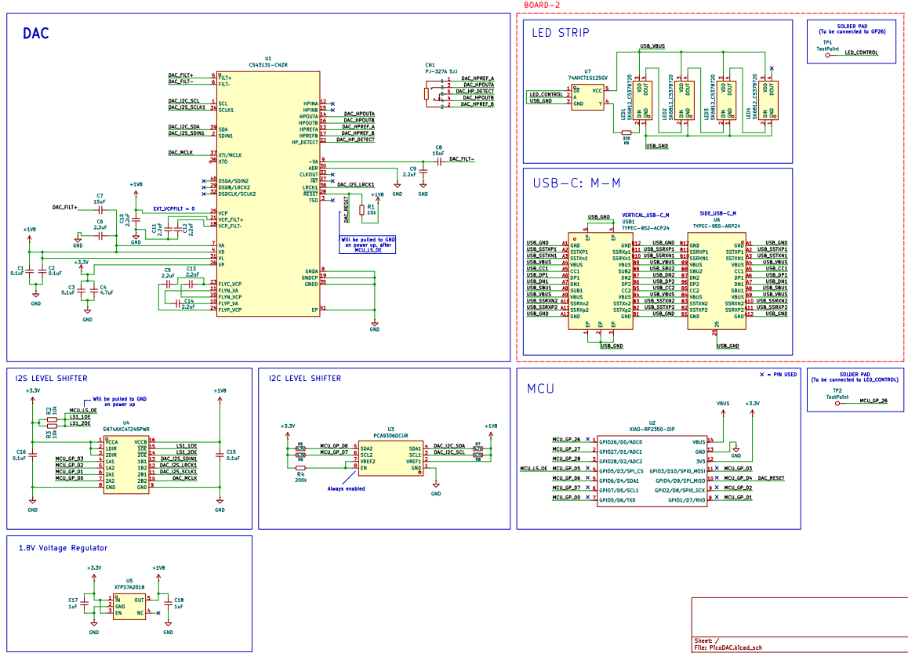

## References
Some of the datasheets were in Chinese so I had to translate parts of it to english using google translate...
- https://www.lcsc.com/datasheet/C51953293.pdf
- https://www.lcsc.com/datasheet/C2840398.pdf
- https://www.lcsc.com/datasheet/C2895018.pdf
- https://wiki.seeedstudio.com/xiao_rp2350_arduino/
- https://www.lcsc.com/datasheet/C52140417.pdf
- https://www.lcsc.com/datasheet/C5378720.pdf

Thank you for reading my journal, Until next time!
 

**Total time spent: 3 hours**

# 2026-08-04: schematics update
This is a pretty long journal that I've finally written after locking-in for nearly 4 hours.

## DAC Schematics

I finished the CS43131 schematics after carefully referencing the datasheet of the CS43131 by completing the VCP_FILT circuit, adding labels to required pins, cleaning up the previous schematics a bit and now it finally looks like this:

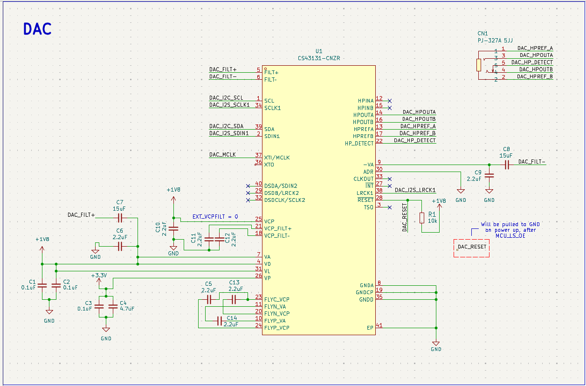

Note the `DAC_RESET` label, It will be connected to some GPIO pin on the MCU to pull the RESET pin of the DAC low, which will enable the DAC as it is active low.

## Logic level shifters

According to the information in the CS43131 datasheet, the logic pins on it run at 1.8V and since the microcontroller I'm using (RP2350A) has GPIO pins at 3.3v logic level, I had to use logic level shifters to shift 3.3V to 1.8V.

I used two different ICs to achieve this:

- TI SN74AXC4T245PWR for level shifting I2S as it is one directional and has 4 channels, exactly the number which I needed for I2S. The schematics for it looks like this:

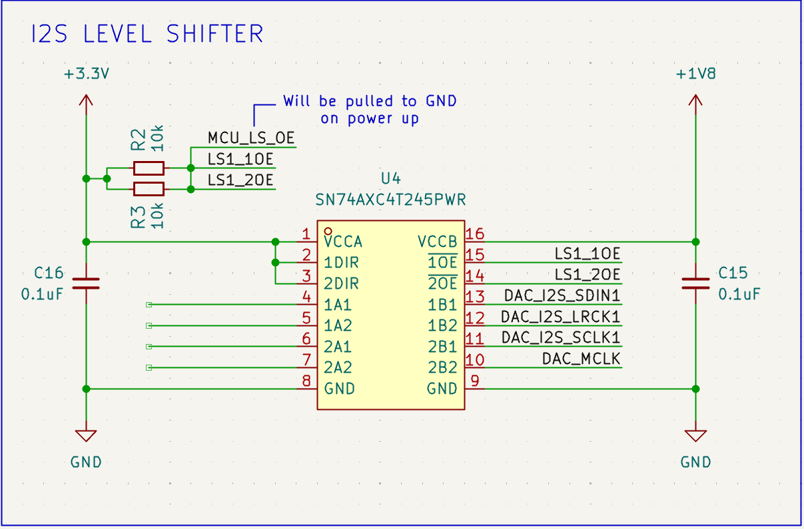
The `MCU_LS_OE` label will be connected to another GPIO pin that will be pulled low BEFORE pulling `DAC_RESET` low to ensure proper functioning and communication between the MCU and the DAC.

- PCA9306 for level shifting I2C as it is bi-directional and has 2 channels, also exactly the number which I needed for I2C. The schematics for it look like this:

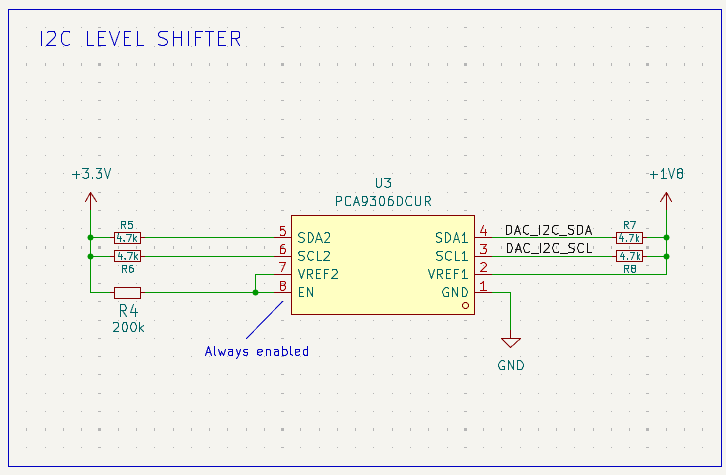
I've left this one to always enabled as it is active high and the datasheet's typical application schematic did the same.

**Note that in both the schematics, I've left out the labels for GPIO pin connections as I have not done them yet. I will be doing that next.**

## MCU schematics

I added labels and connected power and ground to the XIAO RP2350's schematic.

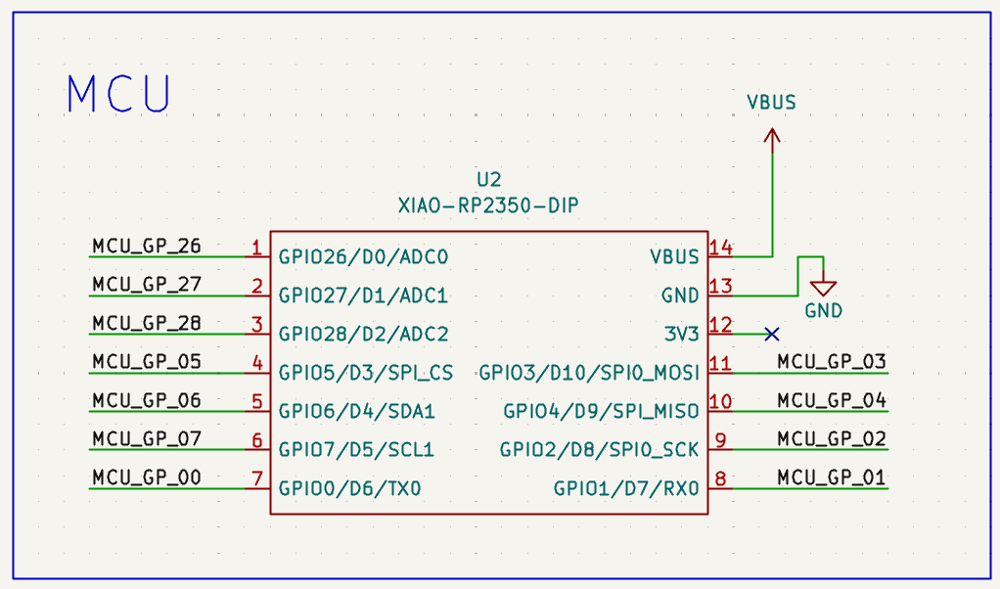

## Next steps

As mentioned previously, I will be connecting the GPIO pin labels to the required DAC pins in the level shifter schematics next.

Also, I will be adding a clean, low noise voltage regulator for 3.3V to 1.8V to supply to the DAC.

Thank you for reading my journal.

## References
- https://www.lcsc.com/datasheet/C1554754.pdf
- https://www.lcsc.com/product-detail/C33196.html
- https://www.lcsc.com/product-detail/C2867798.html (english version: https://www.ti.com/lit/ds/symlink/sn74axc4t245.pdf)
- https://www.totalphase.com/blog/2024/07/what-are-i2c-pull-up-resistors-calculate-their-values/
- https://forum.arduino.cc/t/why-use-a-47k-resistor-between-3-3v-and-sda-and-scl-port-of-esp3266/850553
- https://files.seeedstudio.com/wiki/XIAO-RP2350/res/Seeed-Studio-XIAO-RP2350-v1.0.pdf
 

**Total time spent: 3.5 hours**

# 2026-08-04: schematics init
(this journal failed to post last time hence back to back journal above)

## CS43131 Schematics

I started with the schematics for the CS43131.

First, I completed the headphone jack (3.5mm audio jack) connections. I did this with a TRS instead of a TRRS connector as I do not use the mic of my earphones at all.

Headphone jack schematics:

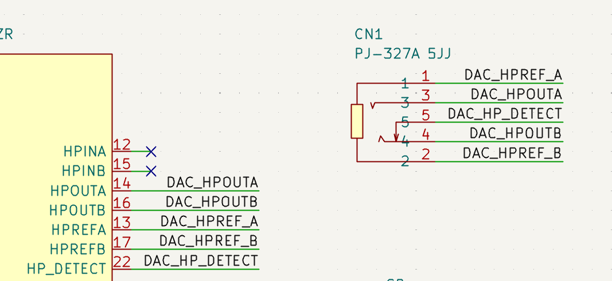

Entire schematics (obviously incomplete) currently look like:

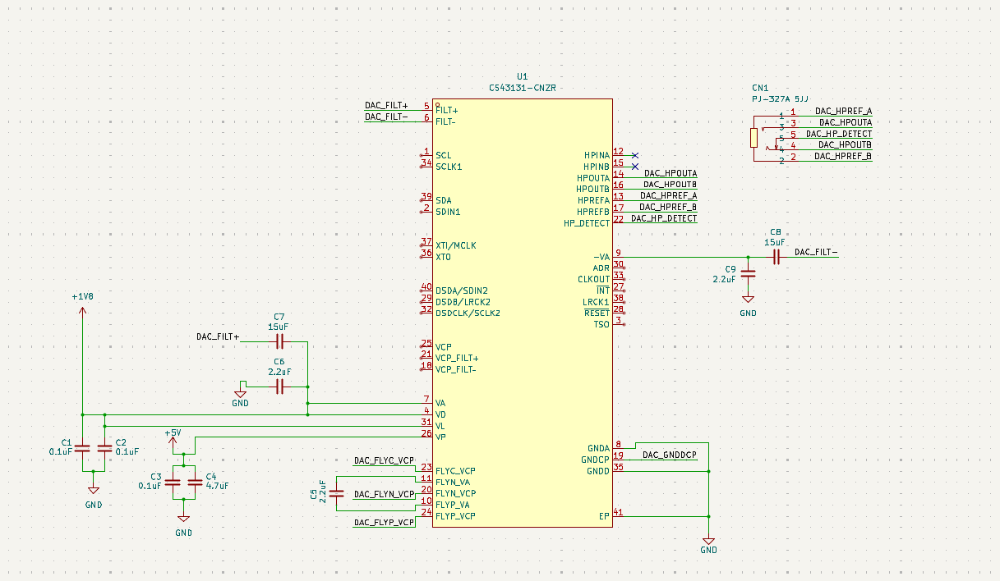

## References:
- https://www.lcsc.com/datasheet/C668605.pdf
- https://www.lcsc.com/datasheet/C1554754.pdf
- https://electronics.stackexchange.com/questions/336836/understanding-audio-jack-connection
- https://electronics.stackexchange.com/questions/95575/how-does-the-phone-detect-if-3-5-mm-jack-circuit-is-closed
 

**Total time spent: 1.5 hours**

# 2026-08-03: Init
## **PicoDAC**

This is a HiFi portable USB-C to 3.5mm headphone jack Digital Audio Converter (DAC).

## Motivation

I bought a cheap USB-C to 3.5mm connector recently and it was working perfectly fine until it sadly broke.

The problem? 

I use my phone in bed a lot (yes i know this is a bad habit) vertically with the bottom of my phone resting on my chest. Since the USB-C port is at the bottom of my phone, anything connected to it has to do the heavy lifting of keeping the phone upright.

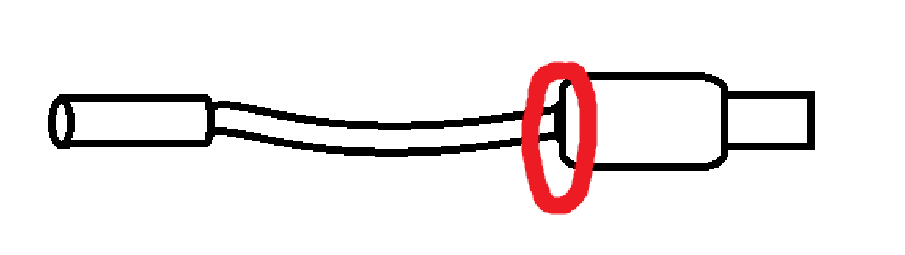
Naturally, the red part I've highlighted in the image slowly got bent and broke :(

To fix this problem and also make a higher-quality DAC, I've started this project.

## The Idea

A flat plane with a 90deg vertical USB-C male plug, where the flat plane is the PCB containing the DAC circuitry. Side mounted 3.5mm headphone jack and some music level LEDs to make it all look good.

Rough sketch looks like this:

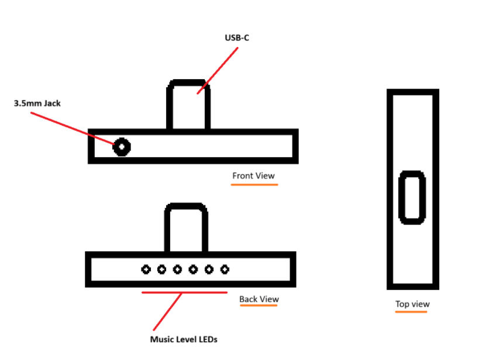 
(i love paint :3)
- I might change some stuff around depending upon the hardware components and PCB layout but the main idea is what I mentioned above.

I've decided to use:
- 1x CS43131-CNZR (A high-performance, 32-bit resolution, stereo audio DAC that supports up to 384-kHz sampling frequency with integrated low-noise ground-centered headphone amplifiers.): [LCSC part](https://www.lcsc.com/product-detail/C965907.html)
- XIAO RP2350 instead of the 2040 as it has integrated fractional dividers (also see: [this git issue](https://github.com/raspberrypi/pico-sdk/issues/1924))

Next I will be starting with the schematics for the PCB.
 

**Total time spent: 1 hours**

