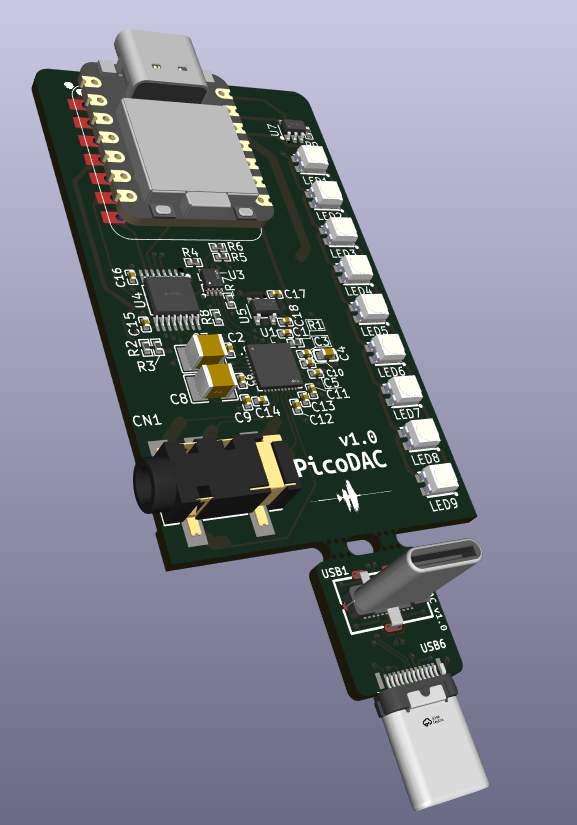
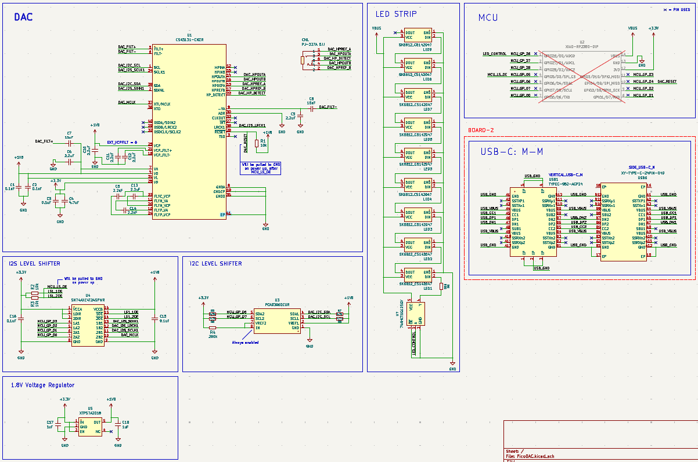
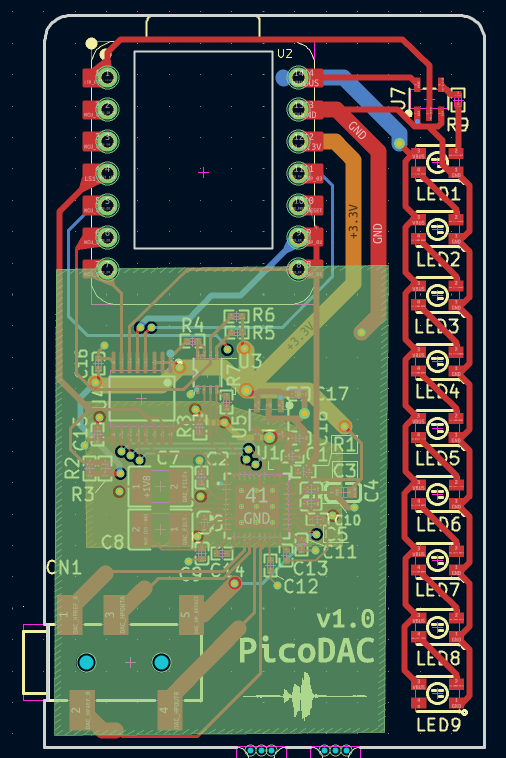
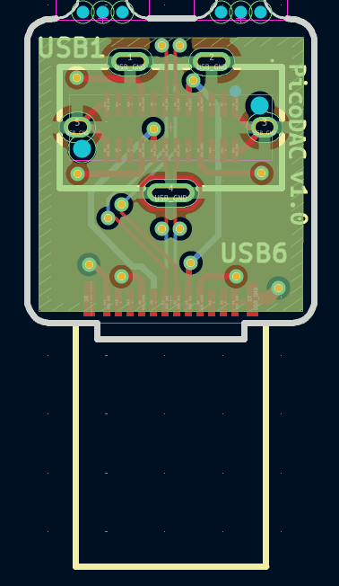
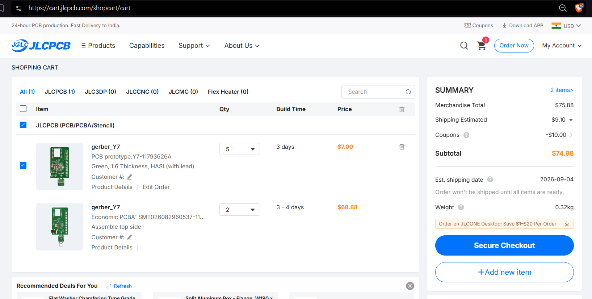
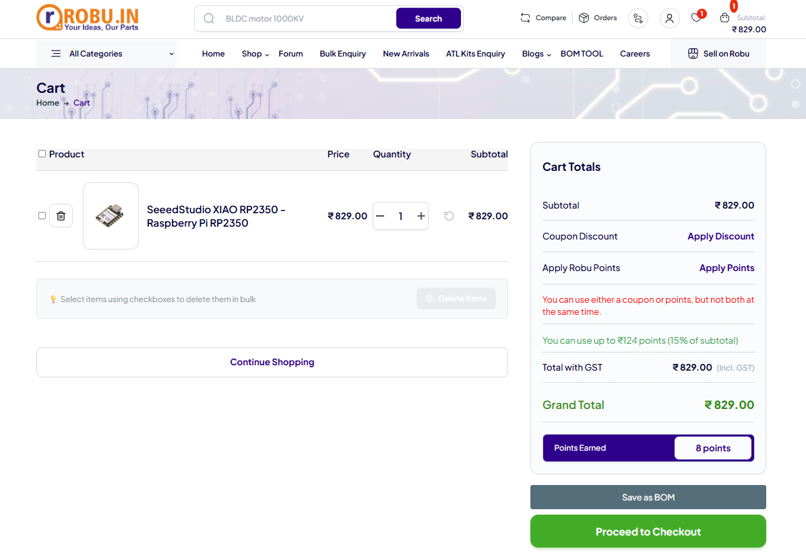

# **PicoDAC**

 

*USB-C to 3.5mm HiFi mini DAC*

Fully custom PCB and 3D printed case.

## Design

### Preview Images
Note that a specially cut transparent acrylic sheet will be used as the top lid of the main PCB case which will be superglued to part of the case that is non-detachable.

As for the case of the board - 2, since it really is just two directly connected USB-C plugs, the top and bottom part of the case will be glued together after seating the board-2 PCB inside it properly (after testing it).

 

All the design files are available in the [CAD folder](./CAD/). 
Exported STEP files for 3d-printing are available in [/CAD/exports](./CAD/exports/).

> Also note that the files:  
> [1_PicoDAC_Case_DetachablePart.step](./CAD/exports/1_PicoDAC_Case_DetachablePart.step) 
> [2_PicoDAC_Case_Main.step](./CAD/exports/2_PicoDAC_Case_Main.step) 
> [3_board2_top_case.step](./CAD/exports/3_board2_top_case.step) 
> [4_board2_bottom_case.step](./CAD/exports/4_board2_bottom_case.step) 
> need to be printed as separate bodies.

## **Motivation**

I recently bought a cheap USB-C to 3.5mm DAC and it was working perfectly fine until it broke.

I use my phone in bed a lot (yes i know this is a bad habit) vertically with the bottom of my phone resting on my chest. Since the USB-C port is at the bottom of my phone, anything connected to it has to do the heavy lifting of keeping the phone upright.

Naturally, the red part I've highlighted in the image slowly got bent and broke :(

To fix this issue, learn more about audio electronics, engineer a cool device and also make a higher-quality DAC in the process, I've started this project.

## **Hardware**
Main hardware components are:
- 1x CS43131-CNZR (A high-performance, 32-bit resolution, stereo audio DAC that supports up to 384-kHz sampling frequency with integrated low-noise ground-centered headphone amplifiers.): [LCSC part](https://www.lcsc.com/product-detail/C965907.html)
- XIAO RP2350 instead of the 2040 as it has integrated fractional dividers (also see: [this git issue](https://github.com/raspberrypi/pico-sdk/issues/1924))
- 9x SK6812 RGB LEDs for music level visualization

> **[View complete BOM](./hardware/bom.csv)**

PCB Preview:

The complete schematics look like:

**Main Board:**

**Board 2:**

> Note that the PCB and schematic files can be opened using KiCAD. They are located in the `/hardware/PicoDAC` directory inside this repository.

Steps for viewing the PCB schematics and layout:
- Open KiCAD
- Click **File** (top left) >> **Open Project**
- Navigate to the the repository's saved destination,
- Open **/hardware/PicoDAC** directory
- Select the file `PicoDAC.kicad_pro`

## **Firmware**
*Checkout the [firmware directory](./firmware/) for the firmware README.md file and current status.*

## Ordering Parts, PCB/PCBA

I will be using JLCPCB along with their PCB Assembly service to get this PCB built assembled as it is the cheapest and best option available in my region.

Other than that, the only extra part is the **XIAO RP2350** MCU which is available on [robu.in](https://robu.in/).

> Note that the following PCB, PCBA costs are for 5 PCBs out of which 2 are assembled (this is the MOQ for JLCPCB) and also I have used basic components instead of extended wherever possible to reduce costs. 

| S.No | Name                                 | Description                                        | Qty | Product URL                                                                     | Effective Cost ($) |
| ---: | ------------------------------------ | -------------------------------------------------- | --: | ------------------------------------------------------------------------------- | -----------------: |
|    1 | JLCPCB_PCB                           | PCB                                                |   1 | ~                                                                               |               7.00 |
|    2 | JLCPCB_Assembly                      | PCB Assembly                                       |   1 | ~                                                                               |              68.88 |
|    3 | JLCPCB_Shipping                      | Lowest price shipping: UPS Worldwide Express Saver |   1 | ~                                                                               |               9.10 |
|    4 | JLCPCB_Coupons                       | ~                                                  |   1 | ~                                                                               |             -10.00 |
|    5 | SeeedStudio XIAO RP2350              | MCU: XIAO RP2350                                   |   1 | [robu.in/...](https://robu.in/product/seeedstudio-xiao-rp2350-raspberry-pi-rp2350/) |               8.69 |
|    6 | Shipping for SeeedStudio XIAO RP2350 | Shipping for XIAO RP2350                           |   1 | ~ |               0.51 |
|      |                                      |                                                    |     | **Total ($)**                                                                   |          **84.18** |

Please checkout the [/hardware/Ordering/](./hardware/Ordering/) directory to get the gerber, bom and cpl files to upload on JLC website.

## **References**
- All datasheets in [**BOM.csv**](./hardware/bom.csv)
- https://datasheets.raspberrypi.com/rp2350/rp2350-datasheet.pdf
- https://github.com/raspberrypi/pico-sdk/issues/1924
- https://electronics.stackexchange.com/questions/336836/understanding-audio-jack-connection
- https://electronics.stackexchange.com/questions/95575/how-does-the-phone-detect-if-3-5-mm-jack-circuit-is-closed
- https://www.lcsc.com/product-detail/C33196.html
- https://www.lcsc.com/product-detail/C2867798.html (english version: https://www.ti.com/lit/ds/symlink/sn74axc4t245.pdf)
- https://www.totalphase.com/blog/2024/07/what-are-i2c-pull-up-resistors-calculate-their-values/
- https://forum.arduino.cc/t/why-use-a-47k-resistor-between-3-3v-and-sda-and-scl-port-of-esp3266/850553
- https://files.seeedstudio.com/wiki/XIAO-RP2350/res/Seeed-Studio-XIAO-RP2350-v1.0.pdf
- https://www.alldatasheet.com/datasheet-pdf/pdf/1265214/TI/TPS7A201825PDQNR.html
- https://wiki.seeedstudio.com/xiao_rp2350_arduino/
- https://forum.kicad.info/t/how-to-create-teardrops-in-pcb-editor/61920/
- https://electronics.stackexchange.com/questions/686845/pcb-design-question-power-plane-or-fat-traces-for-high-current
- https://www.eevblog.com/forum/eda/should-plane-be-used-to-connect-power-or-just-thicker-tracks/

## 😼💖