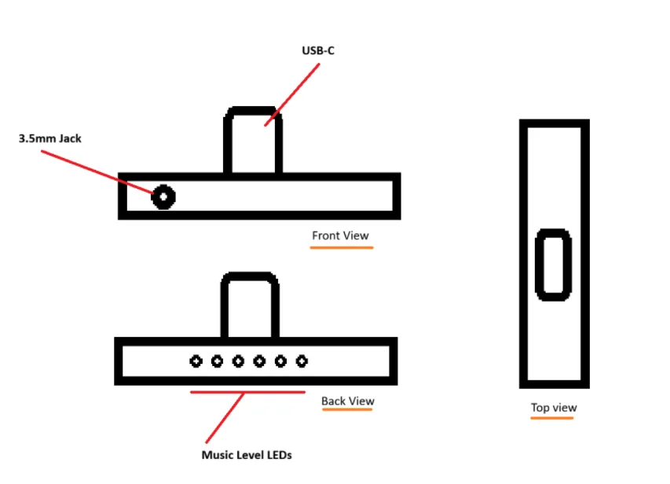

# **PicoDAC**

*USB-C to 3.5mm HiFi mini DAC*

Fully custom PCB and 3D printed case.

Rough sketch:

## **Motivation**

I recently bought a cheap USB-C to 3.5mm DAC and it was working perfectly fine until it broke.

I use my phone in bed a lot (yes i know this is a bad habit) vertically with the bottom of my phone resting on my chest. Since the USB-C port is at the bottom of my phone, anything connected to it has to do the heavy lifting of keeping the phone upright.

Naturally, the red part I've highlighted in the image slowly got bent and broke :(

To fix this problem and also make a higher-quality DAC, I've started this project.

## **Hardware (WIP)**
Currently selected components:
I've decided to use:
- 1x CS43131-CNZR (A high-performance, 32-bit resolution, stereo audio DAC that supports up to 384-kHz sampling frequency with integrated low-noise ground-centered headphone amplifiers.): [LCSC part](https://www.lcsc.com/product-detail/C965907.html)
- XIAO RP2350 instead of the 2040 as it has integrated fractional dividers (also see: [this git issue](https://github.com/raspberrypi/pico-sdk/issues/1924))

## **Firmware**
*Coming Soon*

## **Credits**

## **References**
- https://datasheets.raspberrypi.com/rp2350/rp2350-datasheet.pdf
- https://github.com/raspberrypi/pico-sdk/issues/1924
- https://www.lcsc.com/datasheet/C1554754.pdf

## 😼💖